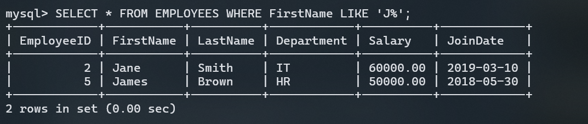

# Advanced SQL Queries

In this section, we'll cover some advanced SQL queries using MySQL. We'll use the existing `EMPLOYEES` table, and add a bit more data if necessary.

## 1. Adding More Data

Let's add some more data to the `EMPLOYEES` table to illustrate the examples better.

```sql
INSERT INTO EMPLOYEES (EmployeeID, FirstName, LastName, Department, Salary, JoinDate) VALUES
(7, 'Sarah', 'Taylor', 'HR', 62000.00, '2020-08-15'),
(8, 'David', 'Anderson', 'Finance', 54000.00, '2023-01-20'),
(9, 'Laura', 'Martinez', 'IT', 58000.00, '2021-02-12');
```

## 2. Advanced SQL Queries

### LIKE Operator:

- **Definition**: The `LIKE` operator is a SQL keyword used to search for a specified pattern within a column. It acts as a filtering tool that allows you to find rows where the data matches a specific pattern.
- **Purpose**: The `LIKE` operator itself is the command that you use to perform the pattern search in SQL.
- **Example**:
  ```sql
  SELECT * FROM EMPLOYEES WHERE FirstName LIKE 'J%';
  ```
- **Output**:

  

### Wildcards:

- **Definition**: Wildcards are special symbols used in conjunction with the `LIKE` operator to define the pattern you want to search for. The two most common wildcards are:
  - `%`: Represents zero or more characters.
  - `_`: Represents a single character.
- **Purpose**: Wildcards enhance the `LIKE` operator by allowing you to create flexible search patterns.
- **Example**:
  ```sql
  SELECT * FROM EMPLOYEES WHERE LastName LIKE '%n';
  ```
- **Output**:

  

- **LIKE Operator**: The command used to perform pattern matching.
- **Wildcards**: Symbols used within the `LIKE` pattern to define the specific search criteria.

### 2.3 IN Operator

- **IN Operator**: The `IN` operator allows you to specify multiple values in a `WHERE` clause. It's a shorthand for multiple `OR` conditions.

### Example :

- Find all employees who work in the 'IT' or 'HR' departments.

  ```sql
  SELECT * FROM EMPLOYEES WHERE Department IN ('IT', 'HR');
  ```

- **Output**

  

### 2.4 BETWEEN Operator

- **BETWEEN Operator**: The `BETWEEN` operator is used to filter the result set within a certain range. The values can be numbers, text, or dates.

### Example :

- Find all employees with a salary between 55000 and 65000.

  ```sql
  SELECT * FROM EMPLOYEES WHERE Salary BETWEEN 55000 AND 65000;
  ```

- **Output**

  

### 2.5 Aliases (AS)

- **Aliases (AS)**: Aliases are used to give a table or a column a temporary name. This name only exists for the duration of that query.

### Example :

- Select the first and last names of employees with the aliases 'First Name' and 'Last Name'.

  ```sql
  SELECT FirstName AS 'First Name', LastName AS 'Last Name' FROM EMPLOYEES;
  ```

- **Output**
