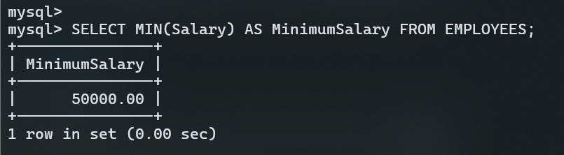
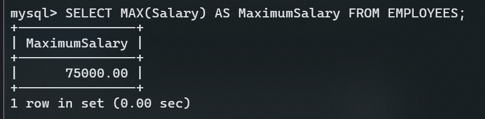
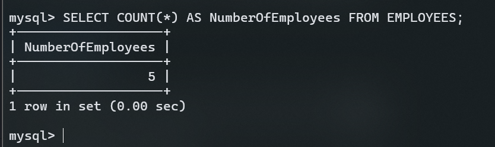
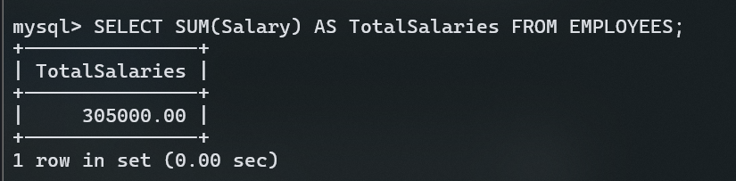

# Aggregate Functions in SQL

In this section, we'll cover some basic aggregate functions in SQL using MySQL. We'll use the existing `EMPLOYEES` table for all the examples.

## 1. EMPLOYEES Table Structure

The `EMPLOYEES` table contains the following columns:

- `EmployeeID`: The unique ID for each employee.
- `FirstName`: The first name of the employee.
- `LastName`: The last name of the employee.
- `Department`: The department where the employee works.
- `Salary`: The salary of the employee.
- `JoinDate`: The date when the employee joined the company.

## 2. Aggregate Functions

### 2.1 MIN and MAX Functions

- **MIN Function**: Finds the smallest value in a column.
- **MAX Function**: Finds the largest value in a column.

**Example:**

```sql
-- Finding the minimum salary
SELECT MIN(Salary) AS MinimumSalary FROM EMPLOYEES;

-- Finding the maximum salary
SELECT MAX(Salary) AS MaximumSalary FROM EMPLOYEES;
```

**Output:**





### 2.2 COUNT Function

- **COUNT Function**: Counts the number of rows in a result set.

**Example:**

```sql
-- Counting the number of employees
SELECT COUNT(*) AS NumberOfEmployees FROM EMPLOYEES;
```

**Output:**



### 2.3 SUM Function

- **SUM Function**: Calculates the total sum of a numeric column.

**Example:**

```sql
-- Calculating the total sum of salaries
SELECT SUM(Salary) AS TotalSalaries FROM EMPLOYEES;
```

**Output:**



### 2.4 AVG Function

- **AVG Function**: Calculates the average value of a numeric column.

**Example:**

```sql
-- Calculating the average salary
SELECT AVG(Salary) AS AverageSalary FROM EMPLOYEES;
```

**Output:**

```

This `.md` file provides a straightforward explanation of each aggregate function with examples using your existing `EMPLOYEES` table. You can execute the provided SQL queries in MySQL to practice.
```
