# 2. Basic SQL Commands

### **SELECT Statement**

#### Introduction to `SELECT`

The `SELECT` statement is fundamental in SQL, used to query data from one or more tables. It allows you to specify which columns you want to retrieve and can be used to filter and sort the results.

### Retrieving data from a database

To retrieve all columns from a table, use `SELECT *`. To select specific columns, list them separated by commas.

```sql
-- Retrieve all columns from the Employees table
SELECT * FROM Employees;

-- Retrieve specific columns from the Employees table
SELECT FirstName, LastName FROM Employees;
```

```plain
Note: To perform all the queries, we need a database and table where the data is stored. This setup will enable us to practice all the SQL commands effectively. Below, I will use SQL code to create a database, a table, and populate it with sample data.

This will provide a practical environment for executing various SQL commands, allowing you to test and understand how each command works.
```

#### Create the Database and Table

First, create a new database and then a table within it. You can copy and paste this code to set up the environment:

```sql
-- Create the database
CREATE DATABASE SampleDB;

-- Use the database
USE SampleDB;

-- Create the table
CREATE TABLE Employees (
    EmployeeID INT PRIMARY KEY,
    FirstName VARCHAR(50),
    LastName VARCHAR(50),
    Department VARCHAR(50),
    Salary DECIMAL(10, 2),
    JoinDate DATE
);

-- Insert sample data
INSERT INTO Employees (EmployeeID, FirstName, LastName, Department, Salary, JoinDate)
VALUES
(1, 'John', 'Doe', 'HR', 50000, '2020-01-15'),
(2, 'Jane', 'Smith', 'IT', 60000, '2019-03-10'),
(3, 'Michael', 'Johnson', 'Finance', 75000, '2021-07-22'),
(4, 'Emily', 'Davis', 'IT', 65000, '2022-11-11'),
(5, 'James', 'Brown', 'HR', 45000, '2018-05-30');

```

---

---

## The outputs shoud look like this after executing the commands :

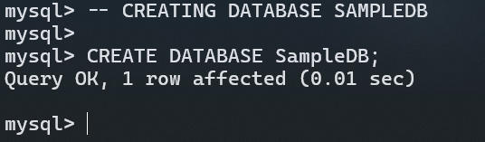

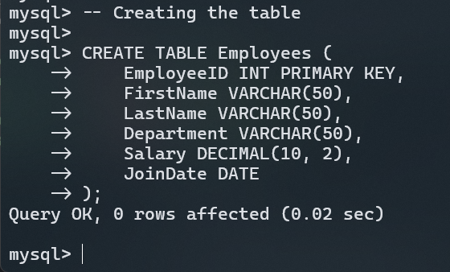

**When writing SQL commands, especially for creating tables, it's often helpful to format your code with line breaks and indentation. This makes the code more readable and easier to debug.**


**In this formatted version, each column definition is on a new line. This clarity helps in several ways:**

**Readability:** It's easier to see each column and its type, making the structure of the table clear at a glance.
Debugging: If there's an error or typo, it's simpler to identify and fix it. Each part of the table definition is separate, so you can quickly locate and address issues.

**Maintenance:** When you need to modify the table structure later, having a well-organized format makes it easier to make changes and understand the existing structure.

Although you can write the entire command on a single line, it can become challenging to spot errors or understand the command, especially in more complex statements. Therefore, we recommend using a formatted approach for better clarity and ease of use.

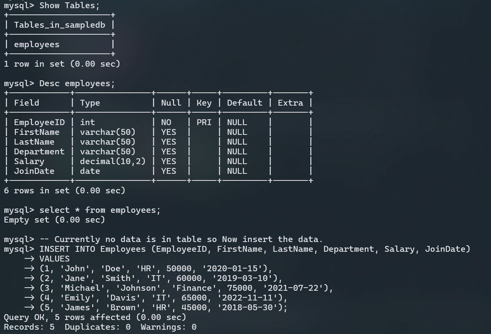

---

---

### **SELECT DISTINCT**

#### Removing duplicates from result sets

The `SELECT DISTINCT` statement ensures that only unique values are returned, eliminating duplicate rows from the results.

### Example:

To get a list of unique departments:

```sql
SELECT DISTINCT Department FROM Employees;
```

#### Result:

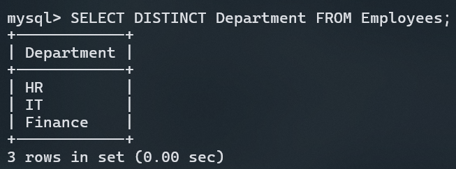

### **WHERE Clause**

#### Filtering results using `WHERE`

The `WHERE` clause filters records that meet specific criteria. It's used to specify the conditions for selecting rows.

### Example:

- To find employees in the 'IT' department:

```sql
SELECT FirstName, LastName, Salary
FROM Employees
WHERE Department = 'IT';
```

#### Result:

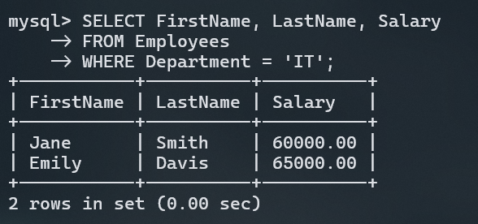

### Operators in `WHERE` Clause

You can use various operators to filter results:

- `=` : Equal
- `>` : Greater than
- `<` : Less than
- `>=` : Greater than or equal
- `<=` : Less than or equal
- `<> or !=` : Not equal (We can choose any of them)
- `BETWEEN` : Between a certain range
- `LIKE` : Search for a pattern
- `IN` : Specify multiple possible values

### Example:

- To find employees with a salary between 50000 and 70000:

```sql

SELECT FirstName, LastName, Salary
FROM Employees
WHERE Salary BETWEEN 50000 AND 70000;

```

#### Result:

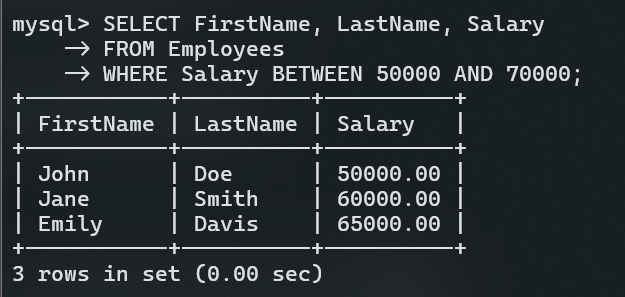

- To find employees whose names start with 'J':

```sql
SELECT FirstName, LastName
FROM Employees
WHERE FirstName LIKE 'J%';

-- To find the Names end with 'J' we will write `%j`   and for finding any specific word or charecter in btw names we will write '%j%' .
```

#### Result:

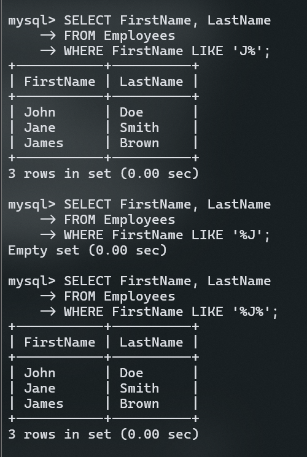

- To find employees in departments 'IT' or 'Finance':

```sql
SELECT FirstName, LastName, Department
FROM Employees
WHERE Department IN ('IT', 'Finance');
```

#### Result:

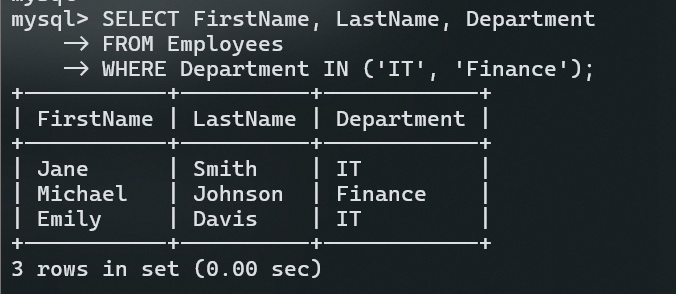

---

### **ORDER BY**

#### Sorting results with `ORDER BY`

The `ORDER BY` clause sorts the result set based on one or more columns. You can sort in ascending (ASC) or descending (DESC) order.

### Example:

- To sort employees by salary in descending order:

```sql
SELECT FirstName, LastName, Salary
FROM Employees
ORDER BY Salary DESC;
```

#### Result:

## 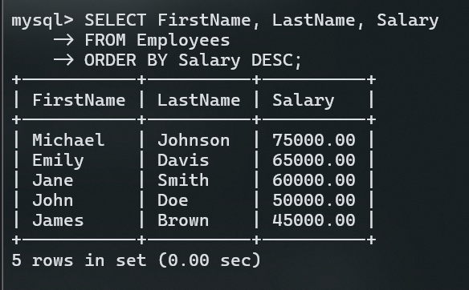

### **AND, OR, NOT Operators**

#### Combining multiple conditions with `AND`, `OR`, `NOT`

These logical operators are used in the `WHERE` clause to combine or negate conditions.

- `AND`: Requires both conditions to be true.
- `OR`: Requires at least one condition to be true.
- `NOT`: Negates a condition.

### Example:

- To find employees in the 'IT' department with a salary greater than 60000:

```sql
SELECT FirstName, LastName, Department, Salary
FROM Employees
WHERE Department = 'IT' AND Salary > 60000;
```

#### Result:

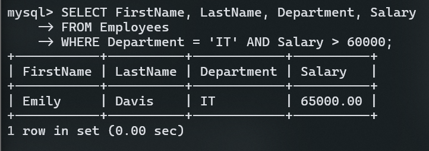

- To find employees who are not in the 'HR' department:

```sql
SELECT FirstName, LastName, Department
FROM Employees
WHERE NOT Department = 'HR';
```

#### Result:

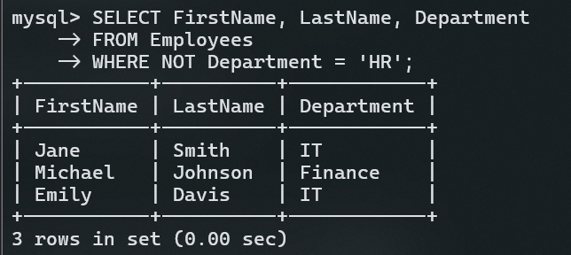

---

### **INSERT INTO**

#### Inserting new data into a table

The `INSERT INTO` statement adds new rows to a table. You need to specify the columns and values for the new row.

### Example:

- To add a new employee:

```sql
INSERT INTO Employees (EmployeeID, FirstName, LastName, Department, Salary, JoinDate)
VALUES (6, 'Robert', 'Wilson', 'Marketing', 55000, '2023-04-18');
```

#### Updated Table:

```sql
-- Write this to view full table

SELECT * FROM employees;

```

#### Before

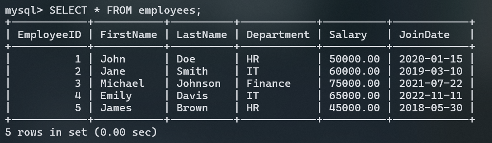

#### After

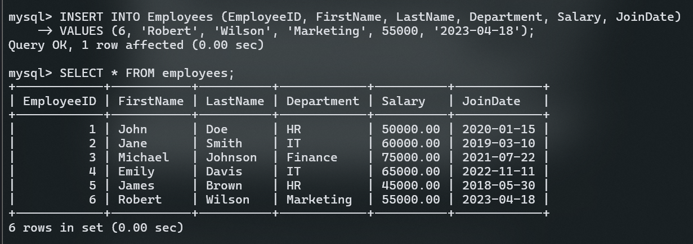

_Note: A new record with EmployeeID 6 has been added._

---

### **NULL Values**

#### Understanding and handling `NULL` values

`NULL` indicates the absence of a value. It's not the same as an empty string or zero. Use `IS NULL` or `IS NOT NULL` to check for `NULL` values.

### Example:

To find employees with a `NULL` salary (none exist in our example):

```sql
SELECT FirstName, LastName, Salary
FROM Employees
WHERE Salary IS NULL;
```

#### Result:

| FirstName          | LastName | Salary |
| ------------------ | -------- | ------ |
| _No records found_ |

---

### **UPDATE Statement**

#### Modifying existing data in a table

The `UPDATE` statement is used to change existing records. You must specify which rows to update and what new values to set.

### Example:

To update the salary of 'James Brown':

```sql
UPDATE Employees
SET Salary = 50000
WHERE FirstName = 'James' AND LastName = 'Brown';
```

#### Updated Table:

| EmployeeID | FirstName | LastName | Department | Salary | JoinDate   |
| ---------- | --------- | -------- | ---------- | ------ | ---------- |
| 1          | John      | Doe      | HR         | 50000  | 2020-01-15 |
| 2          | Jane      | Smith    | IT         | 60000  | 2019-03-10 |
| 3          | Michael   | Johnson  | Finance    | 75000  | 2021-07-22 |
| 4          | Emily     | Davis    | IT         | 65000  | 2022-11-11 |
| 5          | James     | Brown    | HR         | 50000  | 2018-05-30 |
| 6          | Robert    | Wilson   | Marketing  | 55000  | 2023-04-18 |

---

### **DELETE Statement**

#### Removing data from a table

The `DELETE` statement is used to remove rows from a table. Be careful with `DELETE` as it permanently removes data.

### Example:

To delete the record of 'John Doe':

```sql
DELETE FROM Employees
WHERE FirstName = 'John' AND LastName = 'Doe';
```

#### Updated Table:

| EmployeeID | FirstName | LastName | Department | Salary | JoinDate   |
| ---------- | --------- | -------- | ---------- | ------ | ---------- |
| 2          | Jane      | Smith    | IT         | 60000  | 2019-03-10 |
| 3          | Michael   | Johnson  | Finance    | 75000  | 2021-07-22 |
| 4          | Emily     | Davis    | IT         | 65000  | 2022-11-11 |
| 5          | James     | Brown    | HR         | 50000  | 2018-05-30 |
| 6          | Robert    | Wilson   | Marketing  | 55000  | 2023-04-18 |

---

### **SELECT TOP**

#### Limiting the number of records

The `SELECT TOP` clause limits the number of rows returned in the result set. This is particularly useful for pagination or when you need a subset of data.

### Example:

To get the top 3 highest salaries:

```sql
SELECT TOP 3 FirstName, LastName, Salary
FROM Employees
ORDER BY Salary DESC;
```

#### Result:

| FirstName | LastName | Salary |
| --------- | -------- | ------ |
| Michael   | Johnson  | 75000  |
| Emily     | Davis    | 65000  |
| Jane      | Smith    | 60000  |

---

Well will Cover new topics in next Doc
