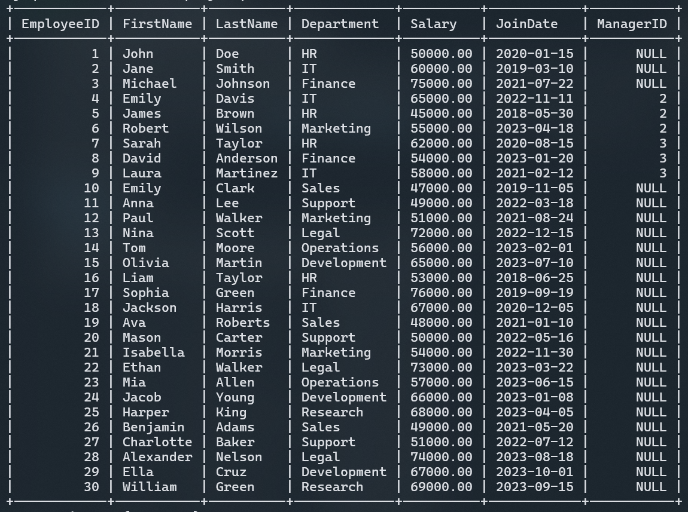
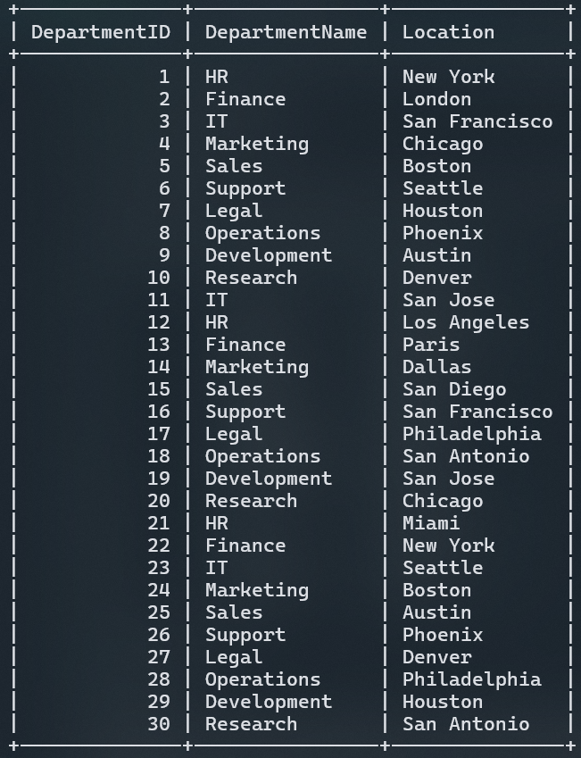
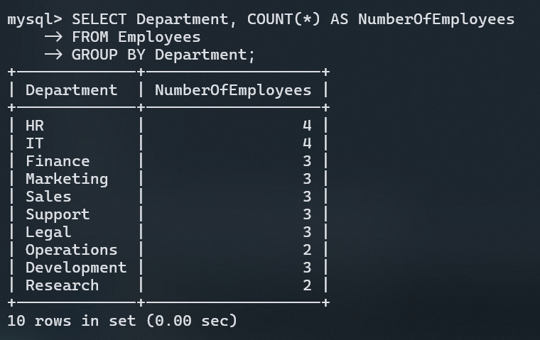
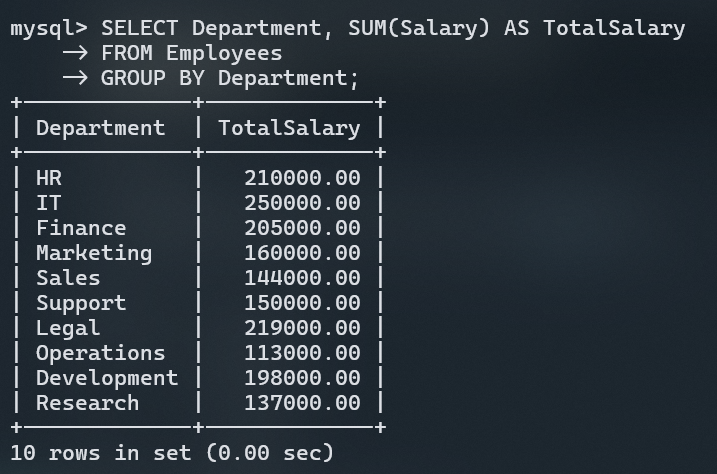
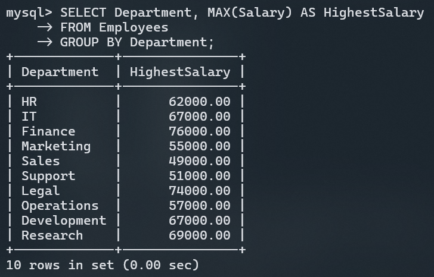
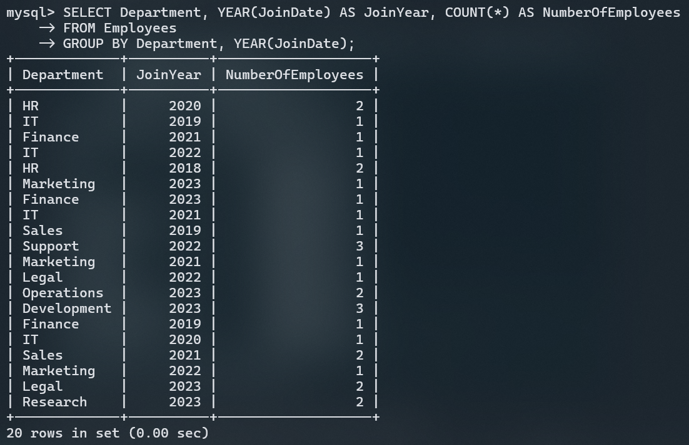
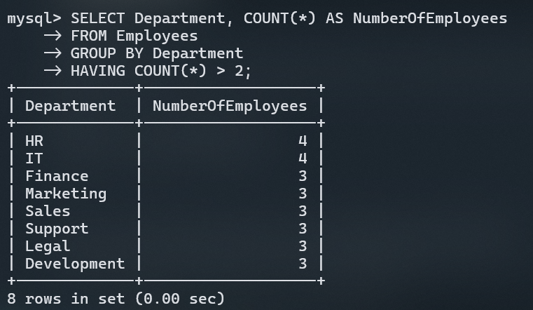
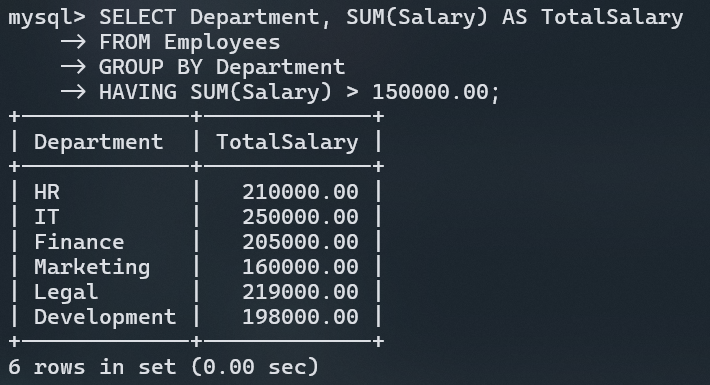
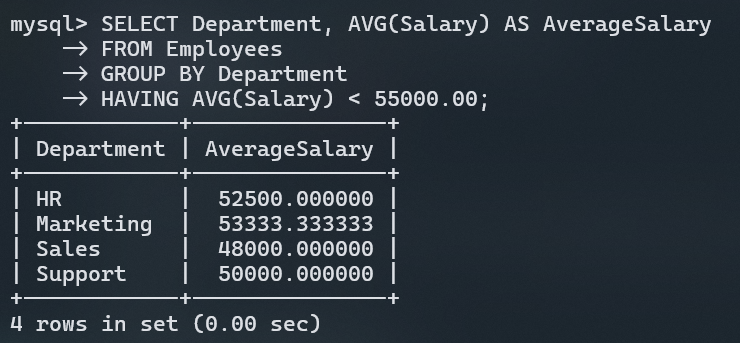

# 6. Grouping and Filtering Data

In SQL, grouping and filtering data are essential operations for analyzing datasets. The `GROUP BY` clause allows you to aggregate data into summary rows, while the `HAVING` clause enables you to filter these grouped results based on specific conditions.

We'll explore these concepts in detail using the `Employees` and `Departments` tables, accompanied by several practical examples.

## Tables Overview

### `Employees` Table

The `Employees` table contains information about employees, including their department, salary, and join date.



### `Departments` Table

The `Departments` table contains information about various departments and their locations.



## GROUP BY Clause

### Theory

The `GROUP BY` clause is a powerful tool in SQL used to organize data into distinct groups. By grouping rows that have identical values in specified columns, you can apply aggregate functions like `COUNT`, `SUM`, `AVG`, `MAX`, and `MIN` to these groups. This allows for concise data summaries and is particularly useful for reporting and data analysis.

### Practical Use Cases

- **Business Reporting:** Summarize sales data by region, product, or sales representative.
- **Financial Analysis:** Calculate total expenditures per department or monthly revenue.
- **Human Resources:** Group employees by department to calculate average salary, count of employees, or total department payroll.

### Example 1: Grouping Employees by Department

Let’s begin by counting the number of employees in each department.

```sql
SELECT Department, COUNT(*) AS NumberOfEmployees
FROM Employees
GROUP BY Department;
```

**Explanation:**

- **SELECT Department:** We are grouping the data based on the `Department` column.
- **COUNT(\*):** Counts the number of employees in each department.
- **GROUP BY Department:** Groups the rows by the `Department` column.

**Result:**



### Example 2: Calculating Total Salary by Department

To understand how much each department spends on salaries, we can sum up the salaries of all employees within each department.

```sql
SELECT Department, SUM(Salary) AS TotalSalary
FROM Employees
GROUP BY Department;
```

**Explanation:**

- **SUM(Salary):** Sums the salaries of all employees in each department.
- **GROUP BY Department:** Groups the results by the `Department` column.

**Result:**



### Example 3: Finding the Maximum Salary in Each Department

We can determine the highest salary in each department.

```sql
SELECT Department, MAX(Salary) AS HighestSalary
FROM Employees
GROUP BY Department;
```

**Explanation:**

- **MAX(Salary):** Finds the maximum salary in each department.
- **GROUP BY Department:** Groups the results by department.

**Result:**



### Example 4: Grouping Employees by Department and Join Year

To analyze the number of employees who joined each department in a particular year, we can use the `YEAR()` function to extract the year from the `JoinDate` column.

```sql
SELECT Department, YEAR(JoinDate) AS JoinYear, COUNT(*) AS NumberOfEmployees
FROM Employees
GROUP BY Department, YEAR(JoinDate);
```

**Explanation:**

- **YEAR(JoinDate):** Extracts the year from the `JoinDate` column.
- **GROUP BY Department, YEAR(JoinDate):** Groups the results by department and the year of joining.

**Result:**



## HAVING Clause

### Theory

The `HAVING` clause allows you to filter groups of data created by the `GROUP BY` clause. While the `WHERE` clause filters rows before they are grouped, `HAVING` filters the groups themselves based on aggregate functions. This is especially useful for refining your results after performing calculations like averages, totals, and counts.

### Practical Use Cases

- **Financial Compliance:** Filter departments with average salaries below a certain threshold.
- **Sales Analysis:** Identify sales teams that have underperformed based on total sales.
- **Operational Efficiency:** Highlight departments with fewer than a specified number of employees.

### Example 1: Filtering Departments with More Than 2 Employees

We can use the `HAVING` clause to list departments that have more than 2 employees.

```sql
SELECT Department, COUNT(*) AS NumberOfEmployees
FROM Employees
GROUP BY Department
HAVING COUNT(*) > 2;
```

**Explanation:**

- **HAVING COUNT(\*) > 2:** Filters departments where the count of employees is greater than 2.

**Result:**



### Example 2: Filtering Departments with Total Salary Above $150,000

We can identify departments with a total salary exceeding $150,000.

```sql
SELECT Department, SUM(Salary) AS TotalSalary
FROM Employees
GROUP BY Department
HAVING SUM(Salary) > 150000.00;
```

**Explanation:**

- **HAVING SUM(Salary) > 150000.00:** Filters departments where the total salary is greater than $150,000.

**Result:**



### Example 3: Filtering Departments with Average Salary Less Than $55,000

To focus on departments where the average salary is below $55,000, use the following query:

```sql
SELECT Department, AVG(Salary) AS AverageSalary
FROM Employees
GROUP BY Department
HAVING AVG(Salary) < 55000.00;
```

**Explanation:**

- **HAVING AVG(Salary) < 55000.00:** Filters departments where the average salary is less than $55,000.

**Result:**



### Example 4: Filtering Departments with Employees Who Joined After 2020

To list departments that have employees who joined after 2020 and have more than one employee, you can combine conditions using `HAVING`.

```sql
SELECT Department, COUNT(*) AS NumberOfEmployees
FROM Employees
WHERE YEAR(JoinDate) > 2020
GROUP BY Department
HAVING COUNT(*) > 1;
```

**Explanation:**

- **WHERE YEAR(JoinDate) > 2020:** Filters employees who joined after 2020.
- **HAVING COUNT(\*) > 1:** Filters departments with more than one such employee.

**Result:**

| Department | NumberOfEmployees |
| ---------- | ----------------- |
| IT         | 2                 |

## Conclusion

Understanding the `GROUP BY` and `HAVING` clauses is essential for any SQL practitioner, as they allow you to efficiently aggregate and filter data. These clauses are powerful tools for generating meaningful insights from your data, whether for business analytics, financial reporting, or operational efficiency.
